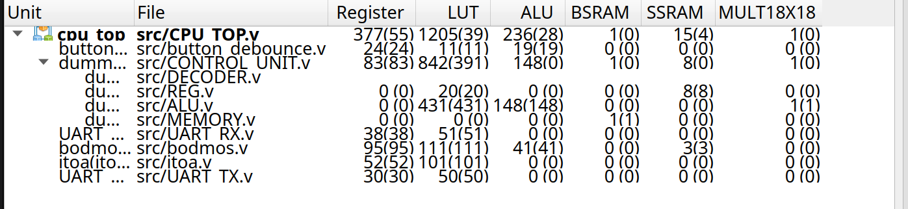
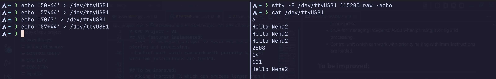

# Mini CPU on FPGA — V1

A hobby project implementing a small CPU on an FPGA (**Sipeed Tang Nano 20K**) in **Verilog**, with a **Python** toolchain for the assembler. It runs programs that print integers and strings to a laptop terminal over UART, and it doubles as a live calculator: echo an arithmetic expression into the serial port and the result comes straight back.

---

## Contents

- [What it does](#what-it-does)
- [Architecture](#architecture)
  - [Hardware modules](#hardware-modules)
  - [Helper modules](#helper-modules)
  - [Software toolchain](#software-toolchain)
- [Instruction set](#instruction-set)
- [How it works](#how-it-works)
- [Getting started](#getting-started)
  - [1. Build the bitstream](#1-build-the-bitstream)
  - [2. Write and assemble a program](#2-write-and-assemble-a-program)
  - [3. Flash the board](#3-flash-the-board)
  - [4. Talk to it over serial](#4-talk-to-it-over-serial)
- [Roadmap](#roadmap)
- [Gallery](#gallery)

---

## What it does

- **Prints integers and strings** to a laptop terminal over the UART protocol.
- **Acts as a live calculator** — send a simple two-number arithmetic expression to the serial port and the result is returned immediately (by design) on the same port. Results are capped at 32767.
- **Does both at once** via a priority-instruction scheme: anything sent from the terminal preempts the currently running program, runs first, then control returns.
- **Uses a readable custom assembly language**, converted to binary by the Python assembler before being loaded into memory.

---

## Architecture

Everything is integrated and instantiated in **[CPU_TOP.v](CPU_TOP.v)**, the top layer that wraps the control unit together with the UART RX/TX paths and the terminal-facing logic.

### Hardware modules

| Module | Role |
| --- | --- |
| [ALU.v](ALU.v) | Arithmetic and logic operations that instructions act on. |
| [CONTROL_UNIT.v](CONTROL_UNIT.v) | Core block that fetches, decodes, and executes instructions. |
| [DECODER.v](DECODER.v) | Decodes instructions and toggles the read/write signals for memory and registers so the ALU and control unit act correctly. |
| [REG.v](REG.v) | Register file — temporary scratch space, wiped between uses. |
| [MEMORY.v](MEMORY.v) | Stores instructions, and doubles as the "bait" address used to stage values for printing. |
| [UART_TX.v](UART_TX.v) / [UART_RX.v](UART_RX.v) | Serial communication between the terminal and the FPGA. |

### Helper modules

| Module | Role |
| --- | --- |
| [bodmos.v](bodmos.v) | Arithmetic front-end: parses expressions from RX, writes an immediate (`imm_pc`) instruction sequence, and injects it into the control unit — halting the current program to run the immediate one first. |
| [itoa.v](itoa.v) | Integer-to-ASCII conversion for processing, storing, and printing (Double Dabble algorithm). |
| [button_debounce.v](button_debounce.v) | Debounces the physical reset button. |

### Software toolchain

| Tool | Role |
| --- | --- |
| [assembler.py](assembler.py) | Reads assembly from a text file and emits binary instructions into `program_init.v`, which `MEMORY.v` includes directly. |

---

## Instruction set

- **Register file:** 16 registers × 16 bits.
- **Memory:** 256 words × 16 bits.
- **Instruction width:** 16 bits, laid out as `[OP_CODE][RD][RA][RB]`.
- **ALU:** 14 operations (add, subtract, and the rest).
- **Decoder:** 16 decoded operations including `LOAD`, `JMP`, `JZ`, `ADD`, `SUB`, and more.
- **Tagged storage** distinguishes integers from ASCII characters when values are stored.

---

## How it works

A normal program runs from memory as you'd expect: fetch → decode → execute. The interesting part is the **priority injection** path. When you send an expression over serial, `bodmos.v` parses it, builds a short instruction sequence for the operation, and injects it into the control unit. The control unit pauses the running program, executes the injected sequence, prints the result via `itoa.v` and `UART_TX.v`, then resumes — so calculator results appear immediately regardless of what the main program was doing.

---

## Getting started

### 1. Build the bitstream

1. Install the toolchain for your board — **Gowin IDE** for the Tang Nano 20K.
2. Add all the Verilog files to a Gowin project.
3. Assign pins for the UART **RX**, UART **TX**, and the **clock** in your constraints file.
4. **Synthesize** and **Place & Route**.

### 2. Write and assemble a program

1. Write your program in the custom assembly language in **[input.txt](input.txt)**.
2. Run the assembler:
   ```bash
   python assembler.py
   ```
   This generates `program_init.v`, which `MEMORY.v` loads automatically.

### 3. Flash the board

Program the generated bitstream onto the FPGA from the Gowin programmer.

### 4. Talk to it over serial

Open the serial port with your terminal of choice (minicom, picocom, or plain `cat`), matching the baud rate (default **115200**, configurable in the source).

The most user-friendly setup:
```bash
# configure the port (raw mode, no local echo)
stty -F /dev/ttyUSB1 115200 raw -echo

# read whatever the board sends back
cat /dev/ttyUSB1
```

Then, from a second terminal, echo an expression into the port to get the result immediately:
```bash
echo '40+40' > /dev/ttyUSB1
```

> Adjust `/dev/ttyUSB1` to match your board's device path.

---

## Roadmap

- **Wider TX** — send values larger than 8 bits together in a single transfer.
- **Bigger machine** — more registers, more memory, larger word size, and a longer instruction list for more room to work.
- **Better integer handling** — cleaner differentiation when storing.
- **A custom compiler** that compiles down to assembly for easier programming.
- **Improved RX handling** and more efficient LUT usage.
- **Negative number support.**
- **Stretch goals** — image processing and a faster link than UART.

---

## Gallery



